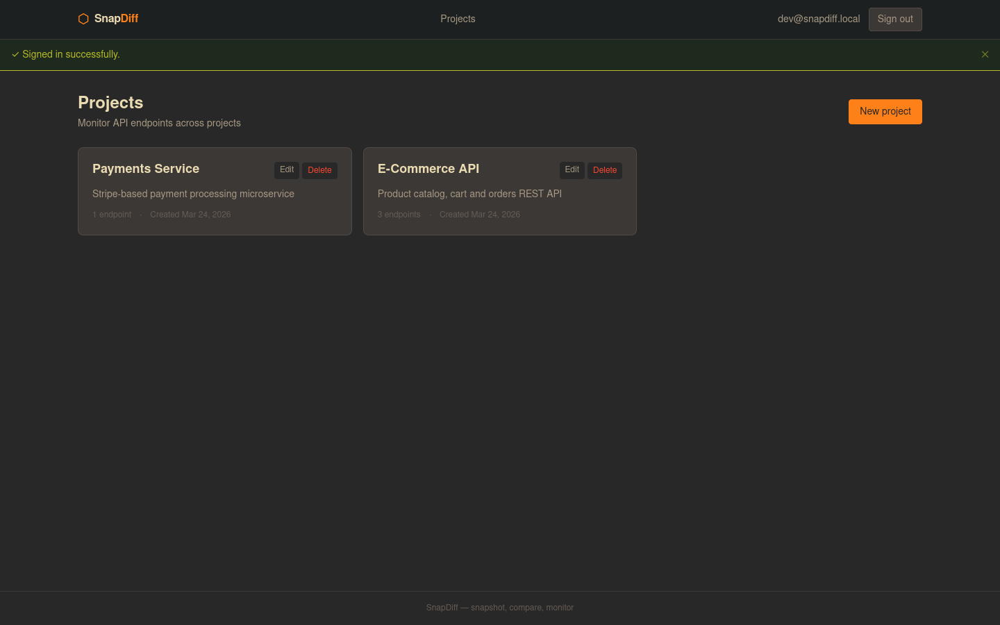
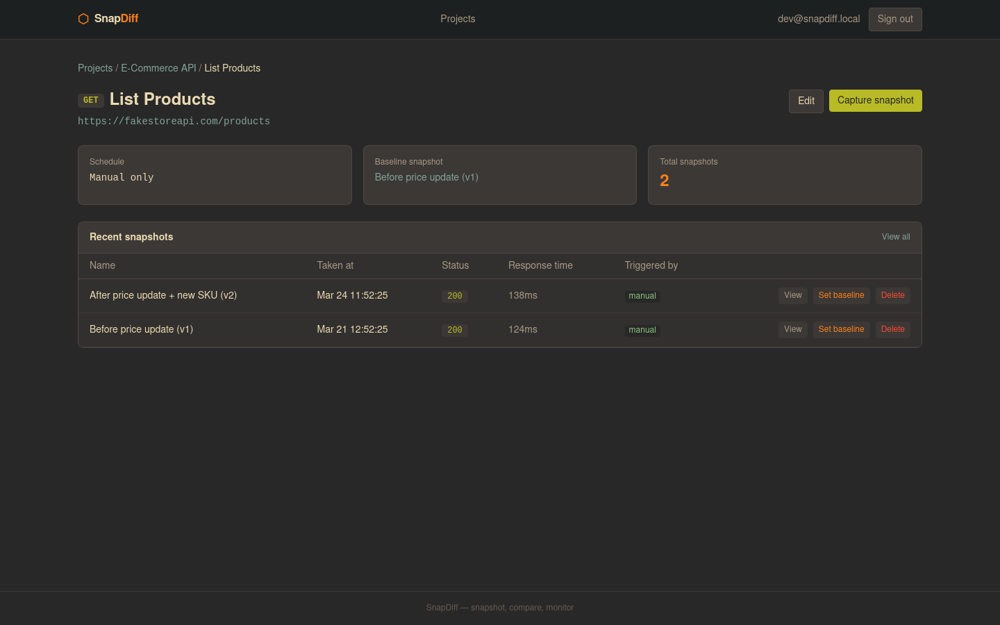
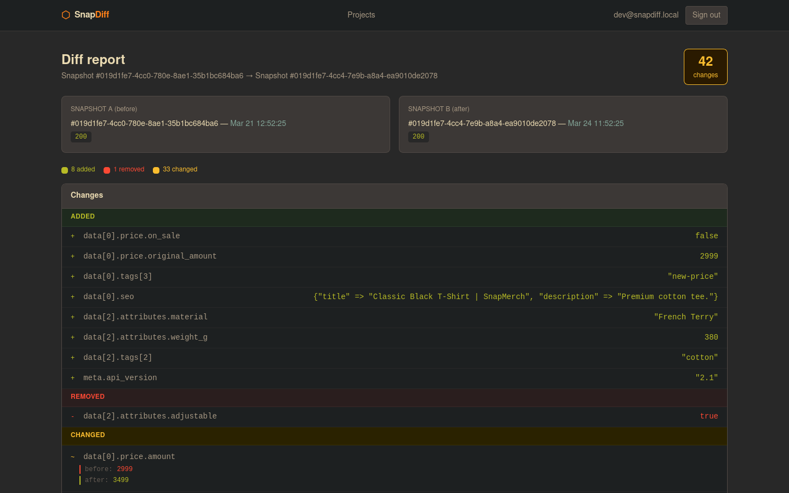

# SnapDiff

> Snapshot, compare and monitor API responses over time. Detect drift before it becomes a problem.

SnapDiff is a Ruby on Rails application for capturing API response snapshots (JSON) and visually comparing them over time. It supports manual captures, scheduled polling, CI/CD webhook triggers, and automatic Slack/Discord alerts when drift is detected.

---

## Screenshots

### Dashboard — Projects & Endpoints



### Snapshot History



### Diff Viewer

Side-by-side JSON comparison with Gruvbox dark theme highlighting: added (green), removed (red), changed (yellow).



---

## Tech Stack

- **Ruby** 3.4+ / **Rails** 8.1+
- **Database**: SQLite3
- **Background Jobs**: Solid Queue (no Redis required)
- **Auth**: Devise (session) + Bearer token (API)
- **Frontend**: Hotwire (Turbo + Stimulus) + TailwindCSS 4.x (Gruvbox dark theme)
- **JSON Diff**: Hashdiff | **HTTP**: Faraday | **Cron**: Fugit

---

## Setup

```bash
git clone <repo>
cd SnapDiff

bundle install
rails db:create db:migrate

bin/dev
```

---

## Running Tests

```bash
bundle exec rails test                     # All tests
COVERAGE_MIN=75 bundle exec rails test     # With coverage enforcement
bundle exec rails test test/models
bundle exec rails test test/services
bundle exec rails test test/controllers
```

---

## Environment Variables

```bash
# Notifications (optional)
SLACK_WEBHOOK_URL=https://hooks.slack.com/services/...
DISCORD_WEBHOOK_URL=https://discord.com/api/webhooks/...

# Rails
SECRET_KEY_BASE=
RAILS_ENV=production
```

---

## API / CI-CD Integration

Trigger a snapshot capture from your pipeline:

```bash
POST /api/v1/snapshots/capture
Authorization: Bearer <api_token>
Content-Type: application/json

{ "endpoint_id": 42 }
```

Example GitHub Actions step:

```yaml
- name: Capture API Snapshot
  run: |
    curl -X POST https://yourdomain.com/api/v1/snapshots/capture \
      -H "Authorization: Bearer ${{ secrets.SNAPDIFF_TOKEN }}" \
      -H "Content-Type: application/json" \
      -d '{"endpoint_id": 42}'
```

Set or update a baseline:

```bash
PATCH /api/v1/endpoints/:id/baseline
Authorization: Bearer <api_token>
```

Find your API token on the profile page, or regenerate it in the Rails console:

```ruby
user.regenerate_api_token!
```

---

## Diff Viewer

`/diff_reports/:id` renders a side-by-side JSON comparison:

| Color | Meaning |
|-------|---------|
| Green (`#b8bb26`) | Added field |
| Red (`#fb4934`) | Removed field |
| Yellow (`#fabd2f`) | Changed value |

A summary badge shows the total number of changes.

---

## Baseline System

Each endpoint can have a **baseline snapshot** — a fixed reference point for all future comparisons. Set it via the UI (`PATCH /endpoints/:id/set_baseline`) or the API above.
